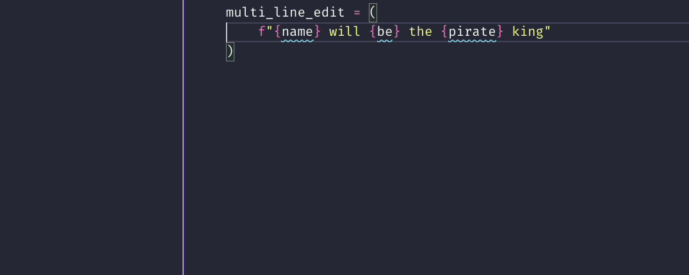

# fstring-converter

This extension converts python string to f-string and vice-versa based on presence of `{.*}` within `quotes` or not respectively.

Since `f-strings` feature is available `python` `3.6` onwards, this extension **should** be `enabled` with **python** versions `3.6+` only. This does **not** play well with `str.format()`.

This extension is inspired by <https://github.com/meganrogge/template-string-converter> which helps with backquotes very nicely.

## Features

This extension converts a string to f-string if `{.*}` is found within `quotes` by prepending `f` to the starting quote position. This evaluation is triggered on each change to code.

Similarly if the above pattern is not found for a string used as `f-string`, it remove the `f` before starting quote position.

Even if the string is going to be a `f-string`, starting with f will remove until the desired pattern is encountered. So, with this extension we need not prepend `f` to any string at all.

At any time undo in editor will revert the genrated code edits.

Conversion Example:
| Input                 | Output                  |
| --------------------- | ----------------------- |
| `""`                  | `""`                    |
| `f""`                 | `""`                    |
| `"{}"`                | `"{}"`                  |
| `f"{}"`               | `"{}"`                  |
| `"{a}"`               | `f"{a}"`                |
| `f"{a}"`              | `f"{a}"`                |
| `"{a}" + "{b}" + "c"` | `f"{a}" + f"{b}" + "c"` |




## Requirements

- This extension should only be enabled when `python` version `3.6+` is in use.

## Extension Settings

This extension contributes the following settings:

- `fstring-converter.enable`: enable/disable this extension

## Known Issues / Limitations

- If used with `python` versions **below** `3.6`, code will be altered but the resulting code will generate syntax errors. This extension currently does not detect python version and can be disabled manually, if needed.
- This extension does not work with `str.format()` either. However with `python` `3.6+` version we really do not need `str.format()` and all its uses can be achieved with `f-strings`.
- This does not look at generating code with valid syntax, rather just add or remove `f` as needed.
- Multi line strings or strings quoted with `"""` or `'''` in a single line are currently not supported. `f-strings` that span multiple line may be written as below which can be handled correctly.

```python
my_str = (
    f"sample {f_string} "
    "continues with a simple string "
    f"terminates with another {f_string}"
)
```

## Release Notes

Please refer to  section.
